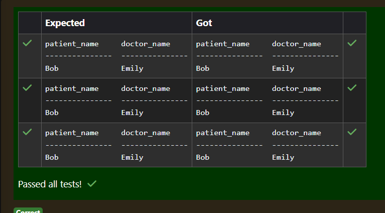
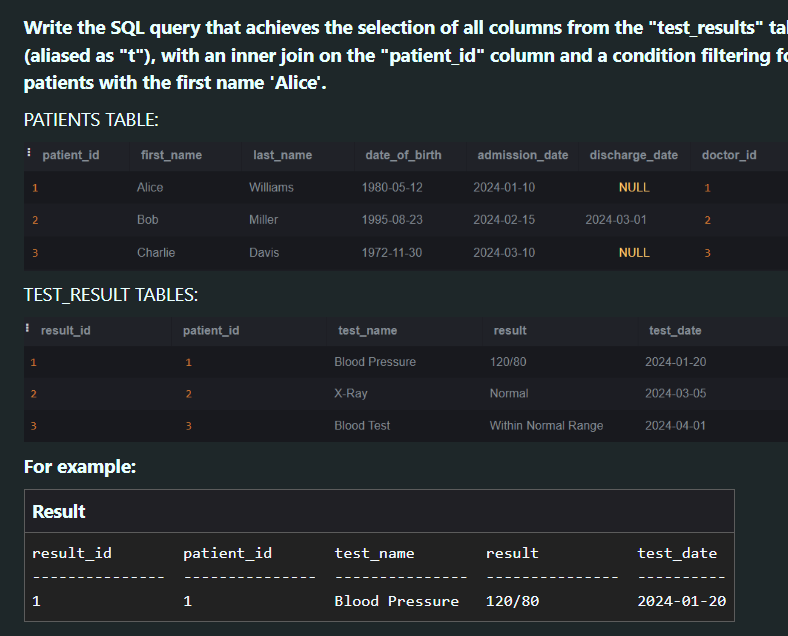
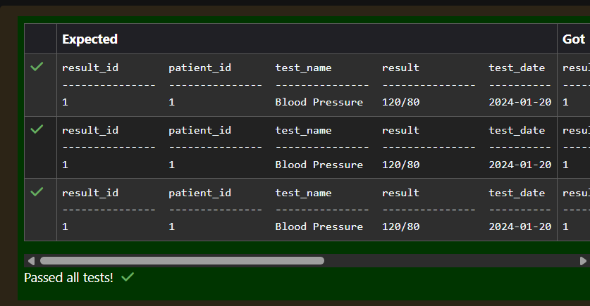
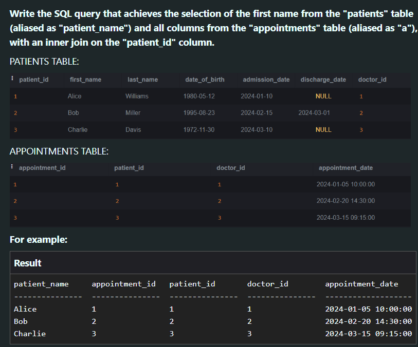
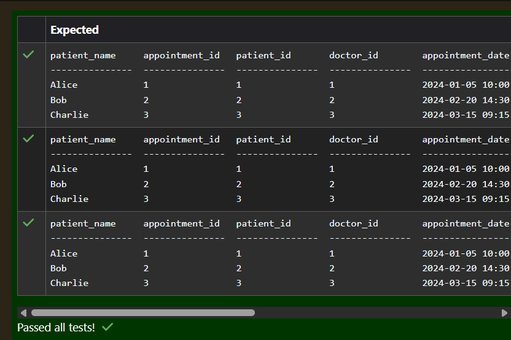
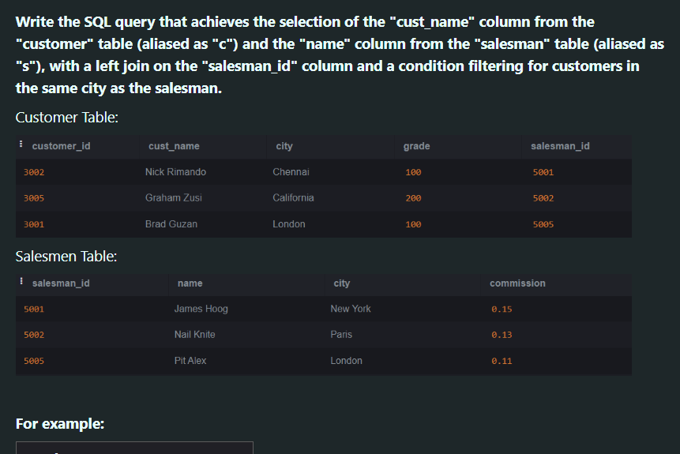
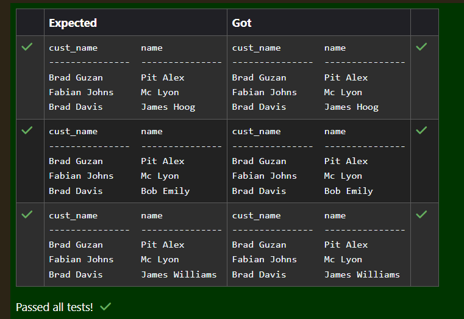

# Experiment 6: Joins

## AIM
To study and implement different types of joins.

## THEORY

SQL Joins are used to combine records from two or more tables based on a related column.

### 1. INNER JOIN
Returns records with matching values in both tables.

**Syntax:**
```sql
SELECT columns
FROM table1
INNER JOIN table2
ON table1.column = table2.column;
```

### 2. LEFT JOIN
Returns all records from the left table, and matched records from the right.

**Syntax:**

```sql
SELECT columns
FROM table1
LEFT JOIN table2
ON table1.column = table2.column;
```
### 3. RIGHT JOIN
Returns all records from the right table, and matched records from the left.

**Syntax:**

```sql
SELECT columns
FROM table1
RIGHT JOIN table2
ON table1.column = table2.column;
```
### 4. FULL OUTER JOIN
Returns all records when there is a match in either left or right table.

**Syntax:**

```sql
SELECT columns
FROM table1
FULL OUTER JOIN table2
ON table1.column = table2.column;
```

**Question 1**
--


```sql
select c.cust_name,c.city,o.ord_no,o.ord_date,o.purch_amt as "Order Amount"
from customer c LEFT JOIN orders o on c.customer_id = o.customer_id order by o.ord_date ASC;
```

**Output:**


**Question 2**
---


```sql
select n.nurse_id,d.department_name from nurses n INNER JOIN departments d ON n.department_id=d.department_id where
n.first_name='David' and n.last_name='Moore';
```

**Output:**


**Question 3**
---


```sql
select c.* from customer c left join orders o on c.customer_id=o.customer_id where o.ord_date between '2012-08-01' 
and '2012-08-30';
```

**Output:**


**Question 4**
---


```sql
select p.* from patients p INNER JOIN test_results tr ON p.patient_id=tr.patient_id 
where tr.test_name='X-Ray' and tr.result='Normal';
```

**Output:**


**Question 5**
---


```sql
select p.first_name ,s.* from patients p inner join surgeries s on p.patient_id=s.patient_id where p.first_name='Alice';
```

**Output:**


**Question 6**
---


```
SELECT c.cust_name, c.city, o.ord_no, o.ord_date, o.purch_amt
FROM customer c
LEFT JOIN orders o
ON c.customer_id = o.customer_id
WHERE c.city = 'London';
```

**Output:**


**Question 7**
---


```sql
SELECT p.first_name AS patient_name, d.first_name AS doctor_name
FROM patients p
INNER JOIN doctors d
ON p.doctor_id = d.doctor_id
WHERE p.date_of_birth > '1990-01-01';
```

**Output:**



**Question 8**
---


```sql
SELECT t.*
FROM test_results t
INNER JOIN patients p
ON t.patient_id = p.patient_id
WHERE p.first_name = 'Alice';
```

**Output:**



**Question 9**
---


```sql
SELECT p.first_name AS patient_name, a.*
FROM patients p
INNER JOIN appointments a
ON p.patient_id = a.patient_id;
```

**Output:**



**Question 10**
---


```sql
SELECT c.cust_name, s.name
FROM customer c
LEFT JOIN salesman s
ON c.salesman_id = s.salesman_id
WHERE c.city = s.city;
```

**Output:**




## RESULT
Thus, the SQL queries to implement different types of joins have been executed successfully.
